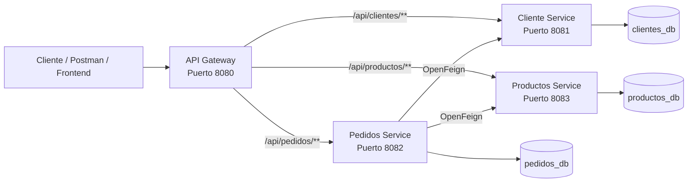

# Sistema de Gestión de Pedidos — Arquitectura de Microservicios

Sistema backend desarrollado con **Java y Spring Boot** para la gestión de clientes, productos y pedidos utilizando una arquitectura basada en microservicios.

El proyecto separa las principales responsabilidades del negocio en servicios independientes y utiliza un **API Gateway** como punto de entrada central para las peticiones. El servicio de pedidos se comunica con los servicios de clientes y productos mediante **OpenFeign** para validar la información necesaria antes de registrar o modificar un pedido.

---

## Descripción del proyecto

El sistema permite administrar:

* Clientes.
* Productos.
* Inventario disponible de productos.
* Pedidos.
* Detalles asociados a cada pedido.
* Estados de los pedidos.
* Consultas de pedidos por cliente.
* Consultas de pedidos por estado.

La solución está dividida en varios módulos Maven, cada uno con una responsabilidad específica.

```text
MicroServicio-SistemaGestionPedidos/
│
├── api-gateway/
├── cliente-service/
├── pedidos-service/
├── productos-service/
│
└── pom.xml
```

El `pom.xml` ubicado en la raíz funciona como proyecto padre y agrupa los diferentes módulos del sistema.

---

# Arquitectura



Todas las peticiones externas pueden realizarse a través del **API Gateway**, ejecutándose en:

```text
http://localhost:8080
```

El Gateway se encarga de redirigir cada petición al microservicio correspondiente.

---

# Microservicios

| Servicio            | Puerto | Responsabilidad                   |
| ------------------- | -----: | --------------------------------- |
| `api-gateway`       | `8080` | Punto de entrada y enrutamiento   |
| `cliente-service`   | `8081` | Gestión de clientes               |
| `pedidos-service`   | `8082` | Gestión y lógica de pedidos       |
| `productos-service` | `8083` | Gestión de productos e inventario |

---

## API Gateway

El módulo `api-gateway` centraliza el acceso a los diferentes microservicios.

### Rutas

| Ruta                | Destino                  |
| ------------------- | ------------------------ |
| `/api/clientes/**`  | `cliente-service:8081`   |
| `/api/pedidos/**`   | `pedidos-service:8082`   |
| `/api/productos/**` | `productos-service:8083` |

Por ejemplo:

```text
GET http://localhost:8080/api/clientes
GET http://localhost:8080/api/productos
GET http://localhost:8080/api/pedidos
```

El consumidor del sistema no necesita acceder directamente a cada puerto interno.

---

# Cliente Service

Microservicio encargado de administrar la información de los clientes.

### Entidad principal

Un cliente contiene información como:

```text
Cliente
├── id
├── nombre
├── primerApellido
├── segundoApellido
├── correo
├── telefono
├── direccion
└── estado
```

El correo electrónico es único para cada cliente.

### Operaciones disponibles

| Método   | Endpoint             | Descripción            |
| -------- | -------------------- | ---------------------- |
| `POST`   | `/api/clientes`      | Crear un cliente       |
| `GET`    | `/api/clientes`      | Listar clientes        |
| `GET`    | `/api/clientes/{id}` | Obtener cliente por ID |
| `PUT`    | `/api/clientes/{id}` | Actualizar cliente     |
| `DELETE` | `/api/clientes/{id}` | Eliminar cliente       |

### Ejemplo de creación

```json
{
  "nombre": "Fabian",
  "primerApellido": "Perez",
  "segundoApellido": "Rodriguez",
  "correo": "fabian@example.com",
  "telefono": "88888888",
  "direccion": "San José, Costa Rica"
}
```

El servicio utiliza validaciones para comprobar campos obligatorios, formato del correo, tamaño de los textos y formato del teléfono.

---

# Productos Service

Microservicio responsable de administrar los productos disponibles en el sistema.

### Entidad principal

```text
Producto
├── id
├── nombre
├── descripcion
├── precio
├── stock
├── codigo
└── estado
```

Cada producto posee un `codigo` único.

### Operaciones disponibles

| Método   | Endpoint              | Descripción             |
| -------- | --------------------- | ----------------------- |
| `POST`   | `/api/productos`      | Crear producto          |
| `GET`    | `/api/productos`      | Listar productos        |
| `GET`    | `/api/productos/{id}` | Obtener producto por ID |
| `PUT`    | `/api/productos/{id}` | Actualizar producto     |
| `DELETE` | `/api/productos/{id}` | Eliminar producto       |

### Ejemplo de creación

```json
{
  "nombre": "Teclado Mecánico",
  "descripcion": "Teclado mecánico para computadora",
  "precio": 35000.00,
  "stock": 15,
  "codigo": "TEC-001"
}
```

Entre las validaciones se encuentran:

* Nombre obligatorio.
* Precio mayor que `0`.
* Stock no negativo.
* Código obligatorio.
* Código único.
* Longitudes máximas para nombre, descripción y código.

---

# Pedidos Service

`pedidos-service` contiene la lógica principal del sistema.

Un pedido pertenece a un cliente y contiene uno o varios detalles de productos.

### Entidad Pedido

```text
Pedido
├── id
├── clienteId
├── fechaPedido
├── estado
├── total
└── detalles[]
```

### Entidad DetallePedido

```text
DetallePedido
├── id
├── pedido
├── productoId
├── cantidad
├── precioUnitario
└── subtotal
```

Existe una relación **uno a muchos** entre `Pedido` y `DetallePedido`.

---

## Creación de pedidos

Para crear un pedido, la API solamente necesita recibir:

* El ID del cliente.
* Los productos.
* La cantidad solicitada de cada producto.

Ejemplo:

```json
{
  "clienteId": 1,
  "detalles": [
    {
      "productoId": 1,
      "cantidad": 2
    },
    {
      "productoId": 3,
      "cantidad": 1
    }
  ]
}
```

El cliente de la API **no envía precios, subtotales ni el total del pedido**.

Estos valores son determinados por el backend utilizando la información actual de los productos.

---

## Flujo de creación de un pedido

Cuando se recibe una solicitud para crear un pedido:

```text
1. El usuario envía el pedido
              │
              ▼
2. Pedidos Service recibe clienteId y detalles
              │
              ▼
3. Consulta Cliente Service mediante OpenFeign
              │
              ▼
4. Comprueba que el cliente exista y esté activo
              │
              ▼
5. Consulta Producto Service por cada producto
              │
              ▼
6. Comprueba que cada producto:
      - exista
      - esté activo
      - tenga stock suficiente
              │
              ▼
7. Obtiene el precio actual del producto
              │
              ▼
8. Calcula:
      subtotal = precio × cantidad
              │
              ▼
9. Suma los subtotales
              │
              ▼
10. Calcula el total del pedido
              │
              ▼
11. Guarda Pedido + DetallePedido
```

Esto evita confiar en valores monetarios enviados por el consumidor de la API.

---

# Comunicación entre microservicios

`pedidos-service` utiliza **Spring Cloud OpenFeign** para comunicarse con los otros servicios.

### Comunicación con Cliente Service

```text
pedidos-service
      │
      │ GET /api/clientes/{id}
      ▼
cliente-service
```

Se utiliza para comprobar la información y el estado del cliente asociado al pedido.

### Comunicación con Productos Service

```text
pedidos-service
      │
      │ GET /api/productos/{id}
      ▼
productos-service
```

Se utiliza para obtener información como:

* Identificador.
* Precio.
* Stock.
* Estado del producto.

Las URLs de estos servicios son configurables mediante:

```properties
services.cliente.url=http://localhost:8081
services.producto.url=http://localhost:8083
```

---

# Estados de un pedido

Los pedidos utilizan los siguientes estados:

```text
PENDIENTE
CONFIRMADO
COMPLETADO
CANCELADO
```

Un pedido nuevo inicia en estado:

```text
PENDIENTE
```

El servicio también controla las transiciones de estado permitidas mediante su capa de validación.

---

# Endpoints de pedidos

| Método   | Endpoint                           | Descripción           |
| -------- | ---------------------------------- | --------------------- |
| `POST`   | `/api/pedidos`                     | Crear pedido          |
| `GET`    | `/api/pedidos`                     | Listar pedidos        |
| `GET`    | `/api/pedidos/{id}`                | Obtener pedido por ID |
| `PUT`    | `/api/pedidos/{id}`                | Actualizar pedido     |
| `DELETE` | `/api/pedidos/{id}`                | Cancelar pedido       |
| `GET`    | `/api/pedidos/cliente/{clienteId}` | Pedidos de un cliente |
| `GET`    | `/api/pedidos/estado/{estado}`     | Pedidos por estado    |
| `PATCH`  | `/api/pedidos/{id}/estado`         | Cambiar estado        |

Ejemplo de cambio de estado:

```text
PATCH /api/pedidos/1/estado?nuevoEstado=CONFIRMADO
```

### Cancelación de pedidos

La eliminación de un pedido no realiza necesariamente una eliminación física del registro.

El servicio conserva el pedido como información histórica y modifica su estado a:

```text
CANCELADO
```

---

# Persistencia

Los microservicios de dominio utilizan:

* Spring Data JPA.
* Hibernate.
* MySQL.

Actualmente el proyecto utiliza tres bases de datos:

| Servicio          | Base de datos  |
| ----------------- | -------------- |
| Cliente Service   | `clientes_db`  |
| Pedidos Service   | `pedidos_db`   |
| Productos Service | `productos_db` |

Esto mantiene separados los datos correspondientes a cada contexto del sistema.

---

# Organización interna

Los microservicios siguen una estructura por capas similar a:

```text
src/main/java/com/example/{servicio}/
│
├── common/
├── controller/
├── dto/
│   ├── request/
│   └── response/
├── entity/
├── mapper/
├── repository/
├── service/
└── validator/
```

En el caso de `pedidos-service` también existe:

```text
integration/
├── client/
└── dto/
```

Esta carpeta contiene los componentes necesarios para comunicarse con los demás microservicios.

---

# Responsabilidad de las capas

### Controller

Expone los endpoints REST y recibe las solicitudes HTTP.

### DTO

Define los datos utilizados para recibir solicitudes y devolver respuestas.

Se separan principalmente en:

```text
request
response
```

Esto evita exponer directamente las entidades JPA.

### Service

Contiene la lógica de negocio de cada microservicio.

### Repository

Gestiona la persistencia y el acceso a datos utilizando Spring Data JPA.

### Entity

Representa las entidades almacenadas en MySQL.

### Mapper

Utiliza **MapStruct** para convertir entre entidades y DTOs.

### Validator

Centraliza diferentes validaciones y reglas del dominio.

### Integration

Presente principalmente en `pedidos-service`, contiene la comunicación con otros microservicios.

---

# Tecnologías utilizadas

El proyecto utiliza principalmente:

* **Java 21**
* **Spring Boot 4.x**
* **Spring Cloud**
* **Spring Cloud Gateway**
* **Spring Cloud OpenFeign**
* **Spring Data JPA**
* **Hibernate**
* **Bean Validation**
* **MySQL**
* **MapStruct**
* **Lombok**
* **Maven**
* **REST API**

---

# Requisitos

Antes de ejecutar el proyecto es necesario contar con:

```text
Java 21+
Maven
MySQL Server
Git
```

Puedes verificar Java con:

```bash
java -version
```

Y Maven con:

```bash
mvn -version
```

---

# Instalación

## 1. Clonar el repositorio

```bash
git clone https://github.com/Fabbian-91/MicroServicio-SistemaGestionPedidos.git
```

Ingresar al proyecto:

```bash
cd MicroServicio-SistemaGestionPedidos
```

---

## 2. Crear las bases de datos

En MySQL:

```sql
CREATE DATABASE clientes_db;
CREATE DATABASE productos_db;
CREATE DATABASE pedidos_db;
```

Hibernate se encuentra configurado para actualizar las tablas necesarias a partir de las entidades del proyecto.

---

# Configuración

Los archivos que contienen credenciales de base de datos no deberían almacenar contraseñas reales dentro del repositorio.

Una configuración recomendada para cada microservicio es utilizar variables de entorno.

## Cliente Service

```properties
spring.application.name=clientes-service
server.port=8081

spring.datasource.url=jdbc:mysql://localhost:3306/clientes_db
spring.datasource.username=${DB_USERNAME}
spring.datasource.password=${DB_PASSWORD}
spring.datasource.driver-class-name=com.mysql.cj.jdbc.Driver

spring.jpa.hibernate.ddl-auto=update
```

## Productos Service

```properties
spring.application.name=productos-service
server.port=8083

spring.datasource.url=jdbc:mysql://localhost:3306/productos_db
spring.datasource.username=${DB_USERNAME}
spring.datasource.password=${DB_PASSWORD}
spring.datasource.driver-class-name=com.mysql.cj.jdbc.Driver

spring.jpa.hibernate.ddl-auto=update
```

## Pedidos Service

```properties
spring.application.name=pedidos-service
server.port=8082

spring.datasource.url=jdbc:mysql://localhost:3306/pedidos_db
spring.datasource.username=${DB_USERNAME}
spring.datasource.password=${DB_PASSWORD}
spring.datasource.driver-class-name=com.mysql.cj.jdbc.Driver

spring.jpa.hibernate.ddl-auto=update

services.cliente.url=http://localhost:8081
services.producto.url=http://localhost:8083
```

> No se recomienda publicar usuarios, contraseñas, tokens o claves privadas dentro de `application.properties`.

---

# Compilar el proyecto

Desde la raíz:

```bash
mvn clean install
```

El `pom.xml` principal compila los módulos que forman parte del sistema.

---

# Ejecutar los servicios

Para trabajar localmente se recomienda iniciar los servicios en el siguiente orden:

```text
1. MySQL
2. cliente-service
3. productos-service
4. pedidos-service
5. api-gateway
```

Cada servicio puede ejecutarse desde su carpeta con:

```bash
mvn spring-boot:run
```

Por ejemplo:

```bash
cd cliente-service
mvn spring-boot:run
```

Luego:

```bash
cd ../productos-service
mvn spring-boot:run
```

Luego:

```bash
cd ../pedidos-service
mvn spring-boot:run
```

Y finalmente:

```bash
cd ../api-gateway
mvn spring-boot:run
```

---

# Probar la API

Una vez iniciados todos los servicios, se recomienda consumir la aplicación mediante:

```text
http://localhost:8080
```

## Crear cliente

```bash
curl -X POST http://localhost:8080/api/clientes \
  -H "Content-Type: application/json" \
  -d '{
    "nombre": "Fabian",
    "primerApellido": "Perez",
    "segundoApellido": "Rodriguez",
    "correo": "fabian@example.com",
    "telefono": "88888888",
    "direccion": "San Jose"
  }'
```

## Crear producto

```bash
curl -X POST http://localhost:8080/api/productos \
  -H "Content-Type: application/json" \
  -d '{
    "nombre": "Mouse Gamer",
    "descripcion": "Mouse para computadora",
    "precio": 15000,
    "stock": 20,
    "codigo": "MOUSE-001"
  }'
```

## Crear pedido

Suponiendo que existen el cliente `1` y el producto `1`:

```bash
curl -X POST http://localhost:8080/api/pedidos \
  -H "Content-Type: application/json" \
  -d '{
    "clienteId": 1,
    "detalles": [
      {
        "productoId": 1,
        "cantidad": 2
      }
    ]
  }'
```

El precio unitario, subtotal y total son calculados internamente por el servicio de pedidos.

---

# Flujo completo del sistema

Un flujo típico sería:

```text
Crear cliente
      ↓
Crear productos
      ↓
Crear pedido
      ↓
Pedidos Service consulta Cliente Service
      ↓
Valida cliente
      ↓
Pedidos Service consulta Productos Service
      ↓
Valida producto y stock
      ↓
Obtiene precio actual
      ↓
Calcula subtotales
      ↓
Calcula total
      ↓
Guarda pedido
      ↓
PENDIENTE
      ↓
CONFIRMADO
      ↓
COMPLETADO
```

Alternativamente, un pedido puede finalizar como:

```text
CANCELADO
```

---

# Características principales

* Arquitectura de microservicios.
* API Gateway como punto único de entrada.
* APIs REST.
* Separación de responsabilidades por dominio.
* Persistencia independiente para clientes, productos y pedidos.
* Comunicación entre microservicios mediante OpenFeign.
* Validación de clientes antes de crear pedidos.
* Validación de productos activos.
* Validación de stock disponible.
* Obtención del precio directamente desde Productos Service.
* Cálculo de subtotales en backend.
* Cálculo del total del pedido en backend.
* Gestión de estados de pedidos.
* Consulta de pedidos por cliente.
* Consulta de pedidos por estado.
* Cancelación lógica de pedidos.
* Validación de DTOs.
* Conversión DTO/Entity mediante MapStruct.
* Persistencia mediante Spring Data JPA.
* Manejo estructurado de responsabilidades mediante capas.

---

# Posibles mejoras futuras

El proyecto puede ampliarse posteriormente incorporando:

* Spring Security.
* Autenticación con JWT.
* Service Discovery.
* Config Server centralizado.
* Docker y Docker Compose.
* Documentación con Swagger / OpenAPI.
* Pruebas de integración.
* Testcontainers.
* Circuit Breaker con Resilience4j.
* Mensajería con RabbitMQ o Apache Kafka.
* Observabilidad y métricas.
* Logging centralizado.
* CI/CD con GitHub Actions.
* Despliegue en la nube.

---

# Autor

Proyecto desarrollado por **Fabbian-91** como implementación de un sistema de gestión de pedidos utilizando arquitectura de microservicios con Java y Spring Boot.
